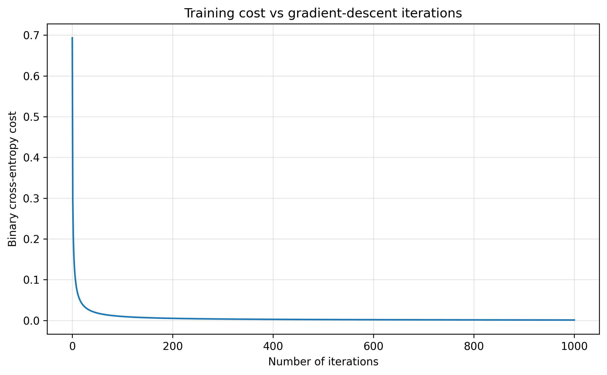
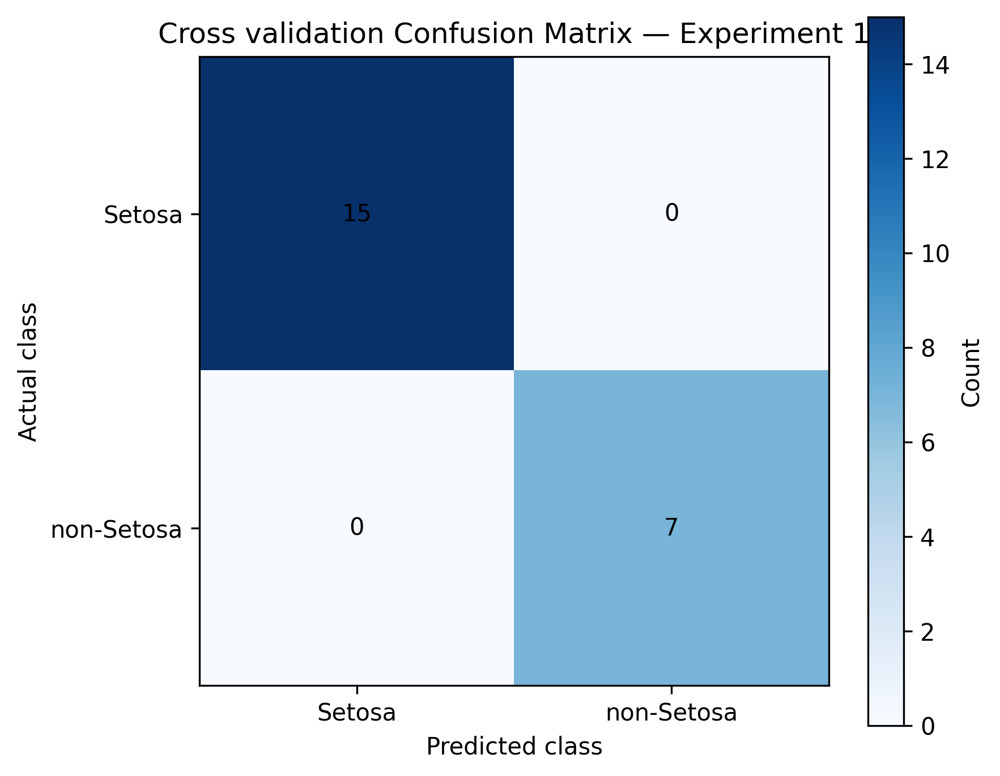
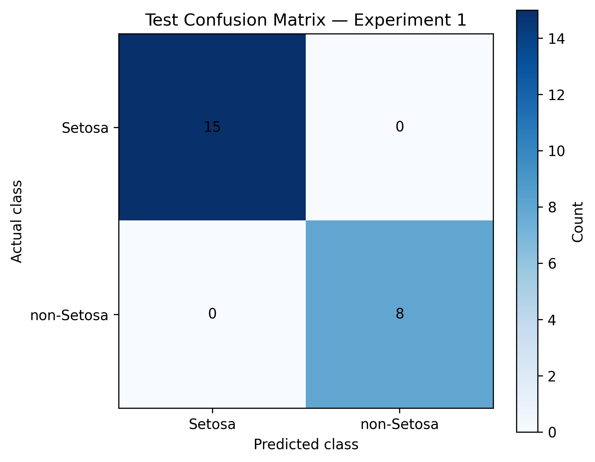

# Logistic Regression From Scratch on the Iris Dataset

> A NumPy-first implementation of binary logistic regression covering preprocessing, optimization, evaluation, experimentation, debugging, and documentation—without using a ready-made classifier.

## 📂 Project Navigation Hub

* [Complete Project Summary](./docs/project_summary.md)
* [Experiment 1: Setosa vs Non-Setosa](./docs/experiment_1_setosa_classification.md)
* [Experiment 2: Versicolor vs Virginica](./docs/experiment_2_versicolor_vs_virginica.md)

---

## Overview

This project implements the complete binary logistic regression training pipeline from scratch using Python and NumPy.

Scikit-learn is used only for:

* loading the Iris dataset
* creating reproducible, stratified dataset splits

The classifier, optimization process, preprocessing logic, predictions, and evaluation metrics were implemented manually.

Two experiments test the same reusable model under different levels of difficulty:

| Experiment   | Classification Task     | Primary Purpose                                                                  |
| ------------ | ----------------------- | -------------------------------------------------------------------------------- |
| Experiment 1 | Setosa vs Non-Setosa    | Pipeline verification, convergence analysis, and numerical behaviour             |
| Experiment 2 | Versicolor vs Virginica | Hyperparameter tuning, generalization analysis, and misclassification inspection |

---

## 🛠️ Core Features Built From Scratch

### Mathematical Engine

* NumPy implementation of the sigmoid function
* Binary cross-entropy cost calculation
* Analytical gradients for weights and bias
* Gradient-descent parameter updates
* Cost-history tracking across iterations
* Probability-based prediction with a fixed classification threshold

### Leakage-Free Preprocessing

* Manual Z-score normalization
* Mean and standard deviation calculated only from training data
* Training-derived statistics reused for cross-validation and test data
* Experiment-specific binary label preparation
* Stratified train, cross-validation, and test splits

### Custom Evaluation Suite

* Confusion matrix
* Accuracy
* Precision
* Recall
* F1 score
* False-positive and false-negative analysis
* Individual misclassified-sample inspection

### Experimentation and Diagnostics

* Learning-rate comparison
* Iteration-count comparison
* Training and cross-validation cost analysis
* Cost-versus-iteration visualizations
* Confusion-matrix heatmaps
* Thresholded predictions compared against probability loss

---

## Experiment Results

| Metric / Configuration      | Experiment 1         | Experiment 2            |
| --------------------------- | -------------------- | ----------------------- |
| Classification task         | Setosa vs Non-Setosa | Versicolor vs Virginica |
| Total examples              | 150                  | 100                     |
| Training / CV / Test split  | 105 / 22 / 23        | 70 / 15 / 15            |
| Learning rate               | 1.0                  | 0.03                    |
| Gradient-descent iterations | 1,000                | 1,000                   |
| Classification threshold    | 0.5                  | 0.5                     |
| Initial training cost       | 0.6931               | 0.6931                  |
| Final training cost         | 0.0011               | 0.1153                  |
| Final cross-validation cost | 0.0087               | 0.1430                  |
| Final test cost             | 0.0006               | 0.2257                  |
| Test accuracy               | 100.00%              | 86.67%                  |
| Test precision              | 100.00%              | 85.71%                  |
| Test recall                 | 100.00%              | 85.71%                  |
| Test F1 score               | 100.00%              | 85.71%                  |
| Test false positives        | 0                    | 1                       |
| Test false negatives        | 0                    | 1                       |

### Result Interpretation

* **Experiment 1** verified that the implementation worked correctly on a strongly separable classification task.
* **Experiment 2** produced a more meaningful evaluation because Versicolor and Virginica measurements overlap.
* In Experiment 2, `alpha = 0.03` with `1,000` iterations and `alpha = 0.01` with `3,000` iterations produced nearly identical costs and identical predictions.
* The `0.03` configuration was selected because it reached the same predictive result using fewer gradient-descent updates.
* The configuration with the lowest binary cross-entropy did not always produce the strongest thresholded classification metrics.

---

## Diagnostic Visualizations

### Training Cost Curves

| Experiment 1 | Experiment 2 |
|---|---|
|  |  |

### Cross-Validation Confusion Matrices

| Experiment 1 | Experiment 2 |
|---|---|
|  |  |

### Test Confusion Matrices

| Experiment 1 | Experiment 2 |
|---|---|
|  |  |

---

## Engineering Highlights

* **Binary-target validation:** An early Experiment 2 pipeline accidentally passed the original labels `1` and `2` instead of the converted binary labels `0` and `1`. The issue was detected by inspecting unique target values, and all invalid outputs were discarded.

* **Array-shape discipline:** The implementation required consistent handling of `X` as `(m, n)`, `W` as `(n,)`, `y` as `(m,)`, gradient vectors as `(n,)`, and the bias as a scalar.

* **Numerical stability:** Predicted probabilities were clipped before logarithmic operations to prevent invalid calculations such as `log(0)` when sigmoid outputs approached exactly `0` or `1`.

* **Loss versus classification:** Experiment 2 demonstrated that lower binary cross-entropy does not always imply better accuracy after applying the `0.5` classification threshold.

* **Readable first implementation:** Explicit loops were retained in parts of the mathematical engine to make the calculations traceable line by line. Vectorization remains a documented future improvement.

* **Test-set limitation:** Two finalist configurations were compared on the Experiment 2 test set. Both produced identical test predictions, but this is acknowledged as a methodological limitation.

---

## Quick Start

### 1. Clone the repository

```bash
git clone <repository-url>
cd iris-logistic-regression-from-scratch
```

### 2. Create a virtual environment

```bash
python -m venv .venv
```

Activate it on Windows:

```bash
.venv\Scripts\activate
```

Activate it on macOS or Linux:

```bash
source .venv/bin/activate
```

### 3. Install dependencies

```bash
pip install -r requirements.txt
```

### 4. Run Experiment 1

```bash
python src/train_experiment_1.py
```

### 5. Run Experiment 2

```bash
python src/train_experiment_2.py
```

Both scripts print the experiment metrics and generate diagnostic plots inside their corresponding `plots/` directories.

---

## Repository Structure

```text
iris-logistic-regression-from-scratch/
│
├── src/
│   ├── preprocessing.py
│   ├── model.py
│   ├── metrics.py
│   ├── visualization.py
│   ├── experiment_1_data.py
│   ├── experiment_2_data.py
│   ├── train_experiment_1.py
│   └── train_experiment_2.py
│
├── docs/
│   ├── experiment_1_setosa_classification.md
│   ├── experiment_2_versicolor_vs_virginica.md
│   └── project_summary.md
│
├── plots/
│   ├── experiment_1/
│   └── experiment_2/
│
├── README.md
├── requirements.txt
├── .gitignore
└── LICENSE
```

---

## Module Responsibilities

| Module                  | Responsibility                                                 |
| ----------------------- | -------------------------------------------------------------- |
| `preprocessing.py`      | Training-derived Z-score normalization                         |
| `model.py`              | Sigmoid, BCE cost, gradients, gradient descent, and prediction |
| `metrics.py`            | Confusion matrix, accuracy, precision, recall, and F1          |
| `visualization.py`      | Cost-curve and confusion-matrix generation                     |
| `experiment_1_data.py`  | Setosa vs Non-Setosa data preparation                          |
| `experiment_2_data.py`  | Versicolor vs Virginica data preparation                       |
| `train_experiment_1.py` | Experiment 1 training, evaluation, and plotting                |
| `train_experiment_2.py` | Experiment 2 tuning, evaluation, error analysis, and plotting  |

---

## Limitations

* The Iris dataset is small and comparatively clean.
* Both experiments are binary classification tasks.
* The model learns only a linear decision boundary.
* Evaluation uses one random split with small validation and test subsets.
* Regularization and k-fold cross-validation were not implemented.
* The classification threshold remained fixed at `0.5`.
* Several mathematical operations remain loop-based.
* No direct sklearn classifier comparison is included.

---

## Future Extensions

* Vectorize the gradient and cost calculations
* Compare against sklearn's `LogisticRegression`
* Add L2 regularization
* Implement multiclass softmax regression
* Use stratified k-fold cross-validation
* Evaluate across multiple random seeds
* Add decision-boundary and class-scatter visualizations
* Experiment with alternative classification thresholds
* Test the implementation on a larger binary dataset

---

## Open-Source Integrity

The core machine-learning implementation was written and understood manually, including:

* preprocessing logic
* sigmoid activation
* binary cross-entropy
* gradient calculation
* gradient descent
* predictions
* evaluation metrics
* experiment execution
* hyperparameter tuning
* debugging
* result interpretation

AI-assisted code generation was used only for portions of the Matplotlib styling and plotting boilerplate in `visualization.py`.

The required visualizations, data flow, integration, generated outputs, and interpretation were designed and controlled as part of the project.

---

## License

This project is licensed under the [MIT License](./LICENSE).