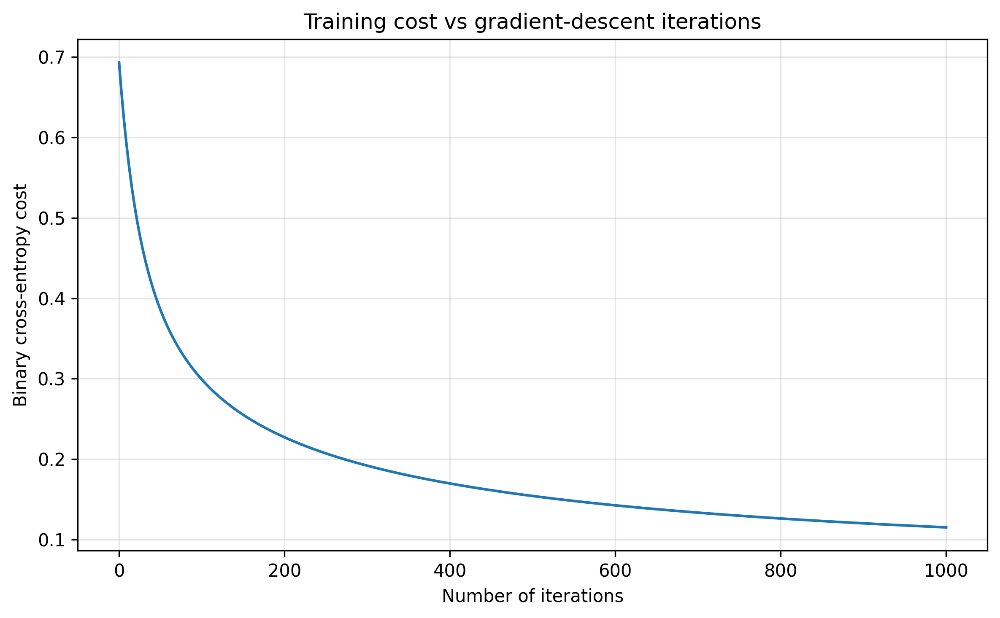
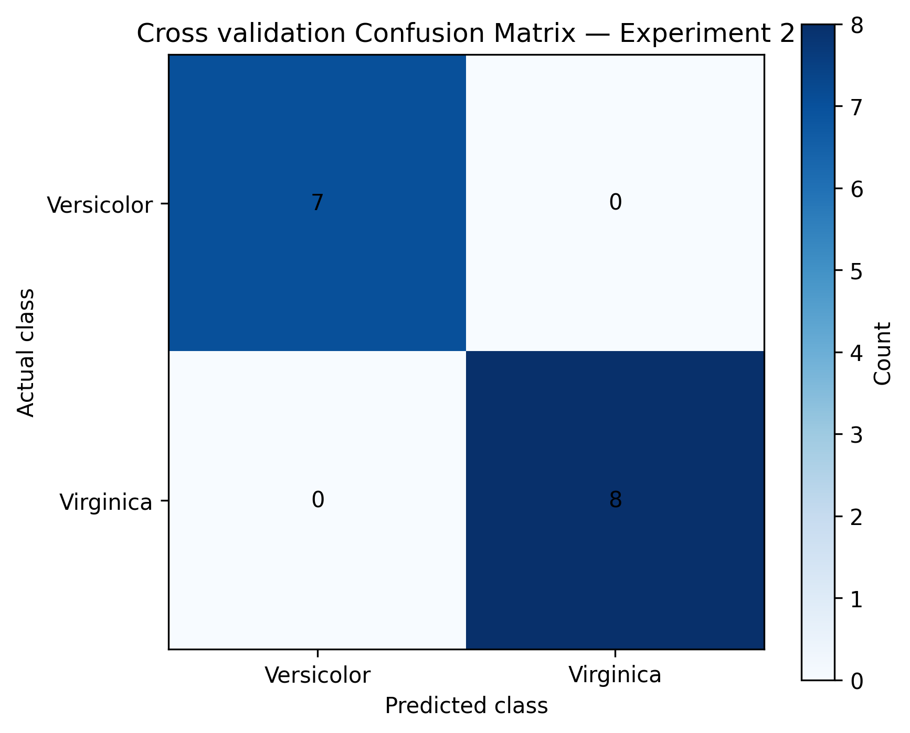
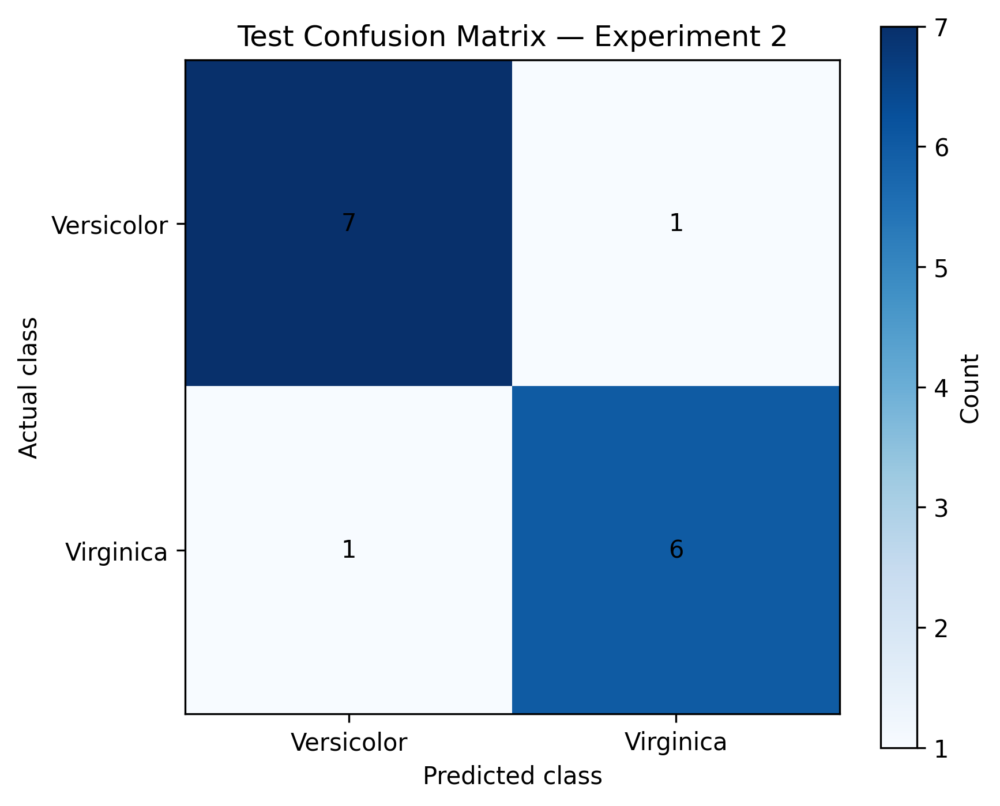

# Experiment 2: Versicolor vs Virginica

## 1. Objective

The objective of this experiment was to train the manually implemented binary logistic regression model to distinguish between two Iris species:

* **Class 0:** Iris Versicolor
* **Class 1:** Iris Virginica

This classification task used only the Versicolor and Virginica samples from the original Iris dataset.

The experiment focused on:

* selecting an appropriate learning rate
* selecting a sufficient number of gradient-descent iterations
* monitoring binary cross-entropy cost
* evaluating the model on training, cross-validation, and test sets
* analysing false-positive and false-negative predictions
* inspecting individual misclassified examples
* documenting the limitations of evaluation on a small dataset

---

## 2. Dataset Preparation

The original Iris dataset contains three species:

| Original label | Species    |
| -------------: | ---------- |
|              0 | Setosa     |
|              1 | Versicolor |
|              2 | Virginica  |

For this experiment, all Setosa examples were removed.

The remaining labels were converted into binary form:

| Binary label | Species    |
| -----------: | ---------- |
|            0 | Versicolor |
|            1 | Virginica  |

The resulting dataset contained:

* 50 Versicolor examples
* 50 Virginica examples
* 100 total examples

Each example contained four numerical features:

1. Sepal length
2. Sepal width
3. Petal length
4. Petal width

---

## 3. Dataset Splitting

The binary dataset was divided into three subsets:

| Subset               | Number of examples | Percentage |
| -------------------- | -----------------: | ---------: |
| Training set         |                 70 |        70% |
| Cross-validation set |                 15 |        15% |
| Test set             |                 15 |        15% |

The split used:

```python
random_state = 42
```

Stratification was applied during both splitting operations to preserve the class balance as closely as possible.

The class distribution was:

| Subset           | Versicolor | Virginica | Total |
| ---------------- | ---------: | --------: | ----: |
| Training         |         35 |        35 |    70 |
| Cross-validation |          7 |         8 |    15 |
| Test             |          8 |         7 |    15 |

The cross-validation set was used for hyperparameter comparison.

The test set was used to evaluate the selected finalist configurations.

---

## 4. Feature Normalization

Z-score normalization was applied to each feature:

[
x_{\text{scaled}}=\frac{x-\mu}{\sigma}
]

where:

* (x) is the original feature value
* (\mu) is the mean of the feature in the training set
* (\sigma) is the standard deviation of the feature in the training set

The mean and standard deviation were calculated using only the training data.

The same training-derived statistics were then applied to:

* training data
* cross-validation data
* test data

This prevented information from the cross-validation and test sets from influencing preprocessing.

---

## 5. Model Configuration

The model calculated a linear score:

[
z=\mathbf{w}^{T}\mathbf{x}+b
]

The sigmoid function converted the score into the predicted probability of the positive class:

[
\sigma(z)=\frac{1}{1+e^{-z}}
]

Because Virginica was Class 1, the sigmoid output represented:

[
P(\text{Virginica}\mid\mathbf{x})
]

The prediction rule was:

[
\hat{y}=
\begin{cases}
1, & \sigma(z)\geq0.5 \
0, & \sigma(z)<0.5
\end{cases}
]

Therefore:

* probability below 0.5 produced a Versicolor prediction
* probability at or above 0.5 produced a Virginica prediction

The model parameters were initialized as:

[
\mathbf{w}=\mathbf{0}
]

[
b=0
]

The initial training cost was:

```text
0.6931471805599424
```

This was expected because zero initialization produced a probability of 0.5 for every training example.

---

## 6. Binary Cross-Entropy Cost

The model was trained by minimizing binary cross-entropy:

[
J(\mathbf{w},b)
===============

-\frac{1}{m}
\sum_{i=1}^{m}
\left[
y^{(i)}\log\left(\hat{y}^{(i)}\right)
+
\left(1-y^{(i)}\right)
\log\left(1-\hat{y}^{(i)}\right)
\right]
]

Predicted probabilities were clipped before applying logarithms to avoid numerical problems caused by values becoming exactly 0 or 1.

Conceptually:

```python
probability = np.clip(probability, epsilon, 1 - epsilon)
```

---

## 7. Hyperparameter Experimentation

The two hyperparameters investigated were:

* learning rate
* number of gradient-descent iterations

The purpose of the experimentation was to compare:

* convergence speed
* final training cost
* final cross-validation cost
* cross-validation accuracy
* precision
* recall
* F1 score
* false-positive and false-negative behaviour

### Experiment table

### Hyperparameter Experiment Results

| Run | Learning Rate | Iterations | Training BCE |     CV BCE | CV Accuracy | CV Precision |   CV Recall |       CV F1 |
| --: | ------------: | ---------: | -----------: | ---------: | ----------: | -----------: | ----------: | ----------: |
|   1 |         0.001 |      1,000 |       0.4415 |     0.4296 |      93.33% |      100.00% |      87.50% |      93.33% |
|   2 |         0.003 |      1,000 |       0.2996 |     0.2958 |      93.33% |      100.00% |      87.50% |      93.33% |
|   3 |         0.010 |      1,000 |       0.1837 |     0.2009 |      93.33% |      100.00% |      87.50% |      93.33% |
|   4 |     **0.030** |  **1,000** |   **0.1152** | **0.1429** | **100.00%** |  **100.00%** | **100.00%** | **100.00%** |
|   5 |         0.100 |      1,000 |       0.0776 |     0.1037 |      93.33% |       88.89% |     100.00% |      94.12% |
|   6 |         0.010 |      3,000 |       0.1153 |     0.1429 |     100.00% |      100.00% |     100.00% |     100.00% |

### Interpretation of Each Run

| Run | Convergence Behaviour                     | CV Prediction Behaviour                           | Conclusion                                                                   |
| --: | ----------------------------------------- | ------------------------------------------------- | ---------------------------------------------------------------------------- |
|   1 | Very slow cost reduction                  | One Virginica example was predicted as Versicolor | Learning rate was stable but too small for only 1,000 iterations             |
|   2 | Faster than Run 1                         | Same predictions as Run 1                         | Improved convergence, but no improvement in thresholded predictions          |
|   3 | Substantially lower cost                  | Still produced one false negative                 | 1,000 iterations were insufficient to reach the strongest CV result          |
|   4 | Fast and stable convergence               | All CV examples were classified correctly         | **Selected final configuration**                                             |
|   5 | Lowest training and CV costs              | One Versicolor example was predicted as Virginica | Lower BCE did not produce the best thresholded classification                |
|   6 | Reached nearly the same solution as Run 4 | All CV examples were classified correctly         | Same predictive result as Run 4, but required three times as many iterations |

### Selected Configuration

| Parameter                | Selected Value |
| ------------------------ | -------------: |
| Learning rate            |       **0.03** |
| Number of iterations     |      **1,000** |
| Classification threshold |        **0.5** |

The configuration using a learning rate of `0.03` and `1,000` iterations was selected because it achieved perfect cross-validation classification while requiring fewer gradient-descent updates than the equivalent `0.01` and `3,000` iteration configuration.

The `0.1` learning-rate configuration produced lower training and cross-validation binary cross-entropy costs, but it introduced one false-positive prediction after applying the classification threshold.

This demonstrated that the configuration with the lowest probability loss was not necessarily the configuration with the strongest thresholded classification metrics.


Smaller learning rates required more gradient-descent iterations to approach the same solution. For example, a learning rate of 0.01 required approximately 3,000 iterations to produce nearly the same training cost, cross-validation cost, and classification metrics as a learning rate of 0.03 with 1,000 iterations.

The results also showed that a lower binary cross-entropy cost did not necessarily produce better thresholded classification metrics. The configuration using a learning rate of 0.1 achieved the lowest training and cross-validation costs, but its cross-validation accuracy was lower than that of the selected configuration.

Binary cross-entropy evaluates the quality and confidence of the predicted probabilities across all examples. Accuracy, precision, recall, and F1 score are calculated only after converting those probabilities into class predictions using the fixed threshold of 0.5.

Therefore, a configuration can achieve a lower average cost by becoming more confident on most correctly classified examples while simultaneously moving one example across the decision threshold in the wrong direction.

The final configuration was selected as:

Learning rate: 0.03
Number of iterations: 1000
Classification threshold: 0.5

Although a learning rate of 0.01 with 3,000 iterations produced almost identical results, the learning rate of 0.03 reached the same predictive performance using one-third as many gradient-descent updates. It was therefore selected for computational efficiency.

---

## 8. Final Hyperparameter Selection

The two strongest configurations were:

### Configuration 1

```text
Learning rate: 0.03
Iterations: 1000
Threshold: 0.5
```

### Configuration 2

```text
Learning rate: 0.01
Iterations: 3000
Threshold: 0.5
```

Both configurations produced identical cross-validation and test predictions.

The final selected configuration was:

```text
Learning rate: 0.03
Iterations: 1000
Threshold: 0.5
```

The configuration using a learning rate of 0.03 was selected because it reached the same predictive result using only one-third as many gradient-descent updates.

The decision was therefore based on computational efficiency rather than improved classification performance.

---

## 9. Cost Results

The final cost values for the selected configuration were:

| Dataset                     | Binary cross-entropy cost |
| --------------------------- | ------------------------: |
| Initial training cost       |        0.6931471805599424 |
| Final training cost         |       0.11528768139669664 |
| Final cross-validation cost |        0.1429517599733162 |
| Final test cost             |        0.2256930431822912 |


The large decrease from the initial training cost confirmed that gradient descent successfully learned useful parameters.

The final training cost was lower than the CV and test costs because the model parameters were optimized directly using the training set.

The test cost was the highest of the three, indicating that the model's probability predictions were less accurate or less confident on the test data.

---

## 10. Training Cost Curve

The training cost was recorded throughout gradient descent and plotted against the number of iterations.



The graph was used to verify that:

* the cost decreased during training
* the selected learning rate was stable
* gradient descent did not diverge
* the model approached convergence

---

## 11. Final Learned Parameters

The final weight vector was:

```text
[ 0.16485369 -0.16900072  1.76200347  2.31953499]
```

The final bias was:

```text
0.14484177468905887
```

The weights corresponded to the following feature order:

| Feature      |      Weight |
| ------------ | ----------: |
| Sepal length |  0.16485369 |
| Sepal width  | -0.16900072 |
| Petal length |  1.76200347 |
| Petal width  |  2.31953499 |

Because Virginica was the positive class:

* positive weights pushed the prediction toward Virginica
* negative weights pushed the prediction toward Versicolor

The petal-length and petal-width coefficients were substantially larger than the sepal coefficients.

For this fitted model, petal measurements contributed more strongly to the final prediction than sepal measurements.

Petal width had the largest positive coefficient.

Because all features were standardized before training, the relative coefficient magnitudes could be compared more meaningfully.

These coefficients describe this specific trained model and should not be interpreted as universal biological conclusions.

---

## 12. Training-Set Results

The training confusion matrix contained:

```text
TN = 34
FP = 1
FN = 1
TP = 34
```

The calculated metrics were:

### Accuracy

[
\frac{34+34}{70}
================

0.9714
]

```text
Training accuracy = 97.14%
```

### Precision

[
\frac{34}{34+1}
===============

0.9714
]

```text
Training precision = 97.14%
```

### Recall

[
\frac{34}{34+1}
===============

0.9714
]

```text
Training recall = 97.14%
```

### F1 score

Because precision and recall were equal:

```text
Training F1 score = 97.14%
```

The model incorrectly classified:

* one Versicolor example as Virginica
* one Virginica example as Versicolor

---

## 13. Cross-Validation Results

The cross-validation confusion matrix contained:

```text
TN = 7
FP = 0
FN = 0
TP = 8
```

The resulting metrics were:

| Metric    |  Result |
| --------- | ------: |
| Accuracy  | 100.00% |
| Precision | 100.00% |
| Recall    | 100.00% |
| F1 score  | 100.00% |

The model correctly classified all 15 cross-validation examples.



The perfect result must be interpreted carefully because the cross-validation set contained only 15 examples.

One changed prediction would alter the reported accuracy by:

[
\frac{1}{15}\times100
\approx
6.67%
]

Therefore, the perfect cross-validation result did not guarantee identical performance on unseen data.

---

## 14. Test-Set Results

The test confusion matrix contained:

```text
TN = 7
FP = 1
FN = 1
TP = 6
```

The model correctly classified 13 out of 15 test examples.

### Accuracy

[
\frac{7+6}{15}
==============

0.8667
]

```text
Test accuracy = 86.67%
```

### Precision

[
\frac{6}{6+1}
=============

0.8571
]

```text
Test precision = 85.71%
```

### Recall

[
\frac{6}{6+1}
=============

0.8571
]

```text
Test recall = 85.71%
```

### F1 score

Because precision and recall were equal:

```text
Test F1 score = 85.71%
```

The final test metrics were:

| Metric    | Result |
| --------- | -----: |
| Accuracy  | 86.67% |
| Precision | 85.71% |
| Recall    | 85.71% |
| F1 score  | 85.71% |



The test set contained:

* one false positive
* one false negative

The equal false-positive and false-negative counts resulted in equal precision and recall.

---

## 15. Misclassified Test Example 1

The first incorrect test prediction was:

```text
Test index: 4
Actual class: Virginica
Predicted class: Versicolor
Predicted probability of Virginica: 0.42016433200716846
```

Original features:

```text
[6.0, 2.2, 5.0, 1.5]
```

Scaled features:

```text
[-0.35380429, -1.89138725, 0.2294994, -0.48830443]
```

The feature order was:

```text
[sepal length, sepal width, petal length, petal width]
```

The predicted probability of Virginica was approximately 0.42.

Because this was below the classification threshold of 0.5, the model predicted Versicolor.

This was a relatively borderline error because the predicted probability was not extremely far from the threshold.

### Approximate feature contributions

The contribution of each standardized feature to the linear score was approximately:

| Feature      | Approximate contribution |
| ------------ | -----------------------: |
| Sepal length |                   -0.058 |
| Sepal width  |                   +0.320 |
| Petal length |                   +0.404 |
| Petal width  |                   -1.133 |

Petal width had the strongest negative contribution.

Because petal width had the largest positive model weight, a below-average scaled petal width strongly reduced the predicted probability of Virginica.

---

## 16. Misclassified Test Example 2

The second incorrect test prediction was:

```text
Test index: 11
Actual class: Versicolor
Predicted class: Virginica
Predicted probability of Virginica: 0.7618365219041233
```

Original features:

```text
[5.9, 3.2, 4.8, 1.8]
```

Scaled features:

```text
[-0.58454621, 1.19239631, -0.13286807, 0.66820606]
```

The model assigned this example a Virginica probability of approximately 0.762.

This was a more confident error than the first incorrect prediction.

### Approximate feature contributions

| Feature      | Approximate contribution |
| ------------ | -----------------------: |
| Sepal length |                   -0.096 |
| Sepal width  |                   -0.202 |
| Petal length |                   -0.234 |
| Petal width  |                   +1.550 |

The petal-width contribution was strongly positive and dominated the remaining feature contributions.

This pushed the predicted probability above the 0.5 threshold even though the true species was Versicolor.

---

## 17. Error Analysis

The two test errors had different characteristics.

### False negative

The Virginica example predicted as Versicolor had a predicted Virginica probability of approximately 0.42.

This was relatively close to the decision boundary and can be interpreted as a borderline example.

### False positive

The Versicolor example predicted as Virginica had a predicted Virginica probability of approximately 0.762.

This was a more confident error and was driven primarily by the strongly positive petal-width contribution.

The test errors were balanced:

* one false positive
* one false negative

The model therefore did not show an obvious tendency to consistently favour one class on this particular test split.

The errors also showed that the measurements of Versicolor and Virginica overlap. A linear decision boundary cannot perfectly separate every example when the feature distributions overlap.

---

## 18. Debugging Discovery

During the initial implementation, the Setosa samples were removed correctly and a binary target array was created.

However, the first version of the dataset-splitting code accidentally used the old filtered labels:

```text
1 and 2
```

instead of the converted binary labels:

```text
0 and 1
```

Binary cross-entropy requires:

[
y\in{0,1}
]

Using labels 1 and 2 made the binary cross-entropy calculation mathematically invalid and produced inconsistent results.

The problem was detected by checking the unique target values:

```python
np.unique(y_train, return_counts=True)
```

The splitting operation was corrected to use the binary target array.

All outputs produced before correcting the label array were discarded.

The valid Experiment 2 results were generated only after confirming that the targets contained the binary values 0 and 1.

---

## 19. Methodology Note

Cross-validation results were used as the primary basis for selecting the strongest configurations.

The two finalist configurations were then compared on the test set:

```text
alpha = 0.03, iterations = 1000
alpha = 0.01, iterations = 3000
```

Both configurations produced identical test predictions.

The configuration using:

```text
alpha = 0.03
iterations = 1000
```

was retained because it required fewer gradient-descent updates.

For a more rigorous future experiment, the test set should ideally be evaluated only once after every hyperparameter decision has been finalized.

---

## 20. Limitations

### 20.1 Small dataset

Only 100 examples remained after removing the Setosa class.

This limits the reliability of conclusions produced by one train-CV-test split.

### 20.2 Small validation and test sets

The cross-validation and test sets contained only 15 examples each.

One prediction changed the accuracy by approximately 6.67 percentage points.

### 20.3 Single random split

The experiment used one split created with:

```text
random_state = 42
```

A different random split could produce different metrics.

### 20.4 Linear model

Binary logistic regression learns a linear decision boundary in the standardized feature space.

It cannot directly represent more complicated nonlinear relationships.

### 20.5 Fixed threshold

The classification threshold remained fixed at:

```text
0.5
```

No threshold tuning was performed.

### 20.6 No repeated cross-validation

The experiment did not use repeated stratified splitting or k-fold cross-validation.

Therefore, the reported results may depend significantly on the selected split.

### 20.7 Test-set comparison

Two finalist configurations were compared on the test set.

Although both produced identical predictions, the test set was not evaluated strictly once.

---

## 21. Possible Extensions

Possible extensions to this experiment include:

* repeated stratified train-CV-test splitting
* stratified k-fold cross-validation
* averaging results across multiple random seeds
* plotting several learning-rate cost curves together
* plotting Versicolor and Virginica feature distributions
* visualizing petal length against petal width
* visualizing the decision boundary using two selected features
* experimenting with alternative classification thresholds
* adding regularization
* comparing the manual model with sklearn logistic regression
* testing the implementation on a larger binary dataset

---

## 22. Final Conclusion

The manually implemented logistic regression model was successfully trained to classify Iris Versicolor and Iris Virginica.

The final selected configuration was:

```text
Learning rate: 0.03
Number of iterations: 1000
Classification threshold: 0.5
```

The final model produced:

| Dataset          | Accuracy |
| ---------------- | -------: |
| Training         |   97.14% |
| Cross-validation |  100.00% |
| Test             |   86.67% |

The final test set contained:

* 7 true negatives
* 1 false positive
* 1 false negative
* 6 true positives

The model made two test errors, both of which were examined using:

* predicted probabilities
* original measurements
* standardized measurements
* individual feature contributions

The experiment also identified and corrected an important label-encoding bug before the valid training process was completed.

The final results indicate that the model learned a useful linear decision boundary, but the overlap between Versicolor and Virginica measurements prevented perfect classification on the selected test set.

The small size of the cross-validation and test sets means that the exact percentage metrics should be interpreted cautiously.